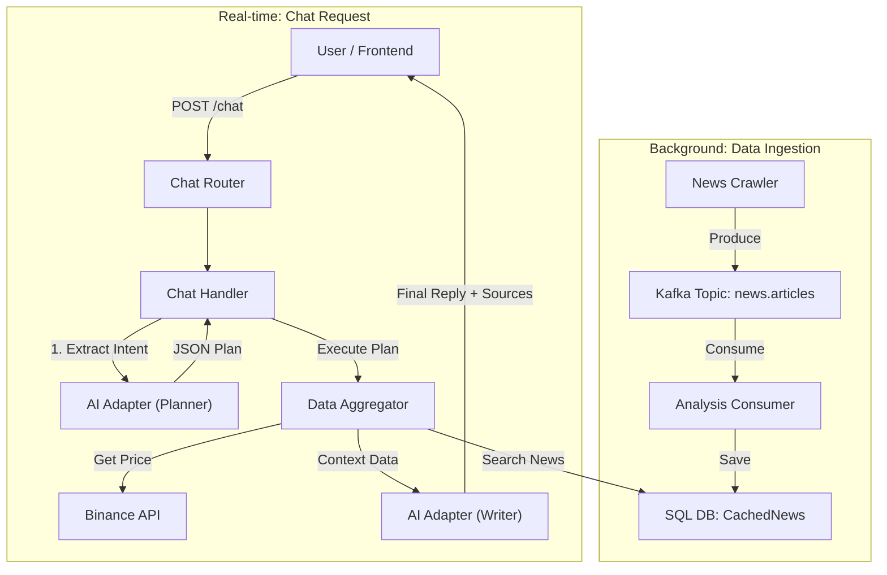

# AI Market Insight Chatbot - System Design

Tài liệu này mô tả kiến trúc và luồng hoạt động của tính năng Chatbot tư vấn thị trường (Market Insight). Hệ thống sử dụng kiến trúc **RAG (Retrieval-Augmented Generation)** kết hợp với mô hình **Event-Driven** để đảm bảo dữ liệu luôn tươi mới và tốc độ phản hồi nhanh.

## 1. Tổng quan kiến trúc (Architecture Overview)

Hệ thống được chia thành 2 luồng xử lý chính:

1. **Background Data Ingestion:** Tự động thu thập và lưu trữ tin tức từ Kafka vào Database cục bộ của Analysis.
2. **Real-time Chat Processing:** Xử lý yêu cầu người dùng theo quy trình **Planner -> Executor -> Writer**.

### Sơ đồ luồng dữ liệu (Data Flow Diagram)



---

## 2. Chi tiết luồng xử lý (Detailed Workflow)

### Phần A: Background - Thu thập dữ liệu (Event-Driven)

Để AI có kiến thức về thị trường, module Analysis tự duy trì một kho dữ liệu tin tức riêng (Self-contained) mà không phụ thuộc vào Module News hay MongoDB bên ngoài.

1. **Input:** Message từ Kafka topic `news.articles` (được bắn từ News Crawler).
2. **Analysis Consumer:**
* Lắng nghe message mới.
* **Lưu trữ (Caching):** Ngay lập tức lưu Title, Content, Source, PublishedDate vào bảng `analysis_cached_news` (SQL).
* *Mục đích:* Giúp việc truy vấn tin tức sau này diễn ra cực nhanh (Local SQL Query) thay vì gọi API qua module khác.


3. **Output:** Dữ liệu nằm sẵn trong bảng `CachedNews`, sẵn sàng để tra cứu.

### Phần B: Real-time - Xử lý Chat (Request-Response)

Khi người dùng gửi câu hỏi, `ChatHandler` sẽ thực hiện quy trình "Tư duy 3 bước":

#### Bước 1: Lập kế hoạch (The Planner)

* **Input:** Câu hỏi người dùng (VD: *"Tại sao BTC giảm giá?"*).
* **Xử lý:** Gửi prompt cho AI để phân loại ý định.
* **Output:** Object kế hoạch (JSON).
```json
{
  "intent_type": "market_insight",
  "symbols": ["BTCUSDT"],
  "period": "24h"
}

```


#### Bước 2: Thu thập dữ liệu (The Executor)

Handler duyệt qua danh sách `symbols` trong kế hoạch và thu thập dữ liệu từ các nguồn:

1. **Giá (Price):** Gọi `BinanceRestClient` để lấy giá realtime 24h.
2. **Tin tức (News):**
* Xử lý Symbol: Cắt bỏ hậu tố (VD: `BTCUSDT` -> `BTC`) để tăng độ chính xác khi tìm kiếm văn bản.
* Query DB: Tìm trong bảng `CachedNews` các bài viết có title/content chứa từ khóa (VD: "BTC", "Bitcoin").
* Format: Tổng hợp lại thành chuỗi văn bản ngữ cảnh (`context_data`).


#### Bước 3: Tổng hợp câu trả lời (The Writer)

* **Input:** Câu hỏi gốc + `context_data` (Giá + Tin tức tìm được).
* **Prompting:** Yêu cầu AI trả lời câu hỏi **CHỈ DỰA TRÊN** dữ liệu được cung cấp.
* **Output:** Câu trả lời ngôn ngữ tự nhiên kèm danh sách nguồn tham khảo (`data_sources`).

---

## 3. Cấu trúc dữ liệu API (API Specification)

### Endpoint

* **URL:** `/api/v1/analysis/chat/`
* **Method:** `POST`

### Request Body

```json
{
  "message": "Cho tui market insight về BTC, tại sao nó biến động vậy?"
}

```

### Response Body

Frontend có thể dùng trường `data_sources` để hiển thị trích dẫn uy tín (Citation).

```json
{
  "reply": "Theo dữ liệu mới nhất, giá BTC đang giảm nhẹ do áp lực bán tháo. Tuy nhiên, tin tức từ Breaking News cho biết Elon Musk vừa tuyên bố mua thêm 1 tỷ USD Bitcoin, điều này có thể là tín hiệu tích cực trong ngắn hạn...",
  "data_sources": [
    "Binance Ticker: BTCUSDT",
    "News (Breaking News): Elon Musk tuyên bố mua thêm 1 tỷ USD Bitcoin",
    "News (Coindesk): Bitcoin ETF sees record inflow"
  ]
}

```

---

## 4. Các Component chính (Key Components)

| Component | File Path | Trách nhiệm |
| --- | --- | --- |
| **ChatRouter** | `features/chat/router.py` | Tiếp nhận Request, Inject Dependencies (Session, Services). |
| **ChatHandler** | `features/chat/handler.py` | "Bộ não" điều phối logic chính (Planner -> Executor -> Writer). |
| **SqlModelRepo** | `infrastructure/repository.py` | Giao tiếp với DB. Chứa hàm `get_recent_news` để tìm tin theo từ khóa. |
| **AI Adapter** | `shared/.../reasoning_adapter.py` | Giao tiếp với LLM (Ollama). Chứa hàm `extract_intent` (Planner) và `chat` (Writer). |
| **Kafka Consumer** | `infrastructure/kafka_consumer.py` | Nhận tin từ Crawler và lưu vào bảng `CachedNews`. |

## 5. Lưu ý cho Developer (Notes)

1. **Data Mismatch:** Khi tìm tin tức, Crawler thường lưu tên coin dạng ngắn (`BTC`, `ETH`), trong khi Planner trả về cặp tiền (`BTCUSDT`). Handler đã có logic `.replace("USDT", "")` để xử lý việc này.
2. **Self-Contained:** Module Analysis KHÔNG phụ thuộc vào MongoDB của module News. Nếu cần xóa/reset dữ liệu tin tức, hãy thao tác trên bảng SQL `analysis_cached_news`.
3. **Testing:** Có thể dùng script `scripts/test_kafka_msg.py` để bắn tin giả lập vào hệ thống nhằm test khả năng phản ứng của AI với tin tức nóng (Breaking News).


## 6. Developer Testing Guide (Hướng dẫn kiểm thử) 🧪

Dưới đây là hướng dẫn giúp Developer verify tính năng Chatbot hoạt động đúng luồng RAG.

### Bước 1: Chuẩn bị dữ liệu (Inject Mock Data)

Để test khả năng "đọc báo" của AI, ta cần bơm một tin tức giả vào hệ thống thông qua Kafka (hoặc script test).

**Sửa file:** `scripts/test_kafka_msg.py`

```python
dummy_news = {
    "url": "test-news-btc-001",
    "title": "Elon Musk tuyên bố mua thêm 1 tỷ USD Bitcoin",
    "content": "Giá BTC dự kiến sẽ tăng mạnh sau tin này. Thị trường phản ứng tích cực.",
    "source": "Breaking News Test",
    "published_date": datetime.now().isoformat()
}
# Chạy script: uv run python scripts/test_kafka_msg.py

```

*Sau khi chạy, đợi khoảng 5s để Consumer lưu tin vào SQL.*

### Bước 2: Test các kịch bản (Test Cases)

Sử dụng `curl` hoặc Postman để gọi API.

#### Case A: Hỏi Insight (Kiểm tra RAG - Giá + Tin tức)

*Mục tiêu:* AI phải nhắc đến tin tức Elon Musk vừa inject và hiển thị nguồn tin.

```bash
curl -X 'POST' \
  'http://localhost:8000/api/v1/analysis/chat/' \
  -H 'Content-Type: application/json' \
  -d '{ "message": "Tại sao Bitcoin biến động mạnh hôm nay?" }'

```

**Kỳ vọng:**

* `reply`: Có nhắc đến "Elon Musk" hoặc "mua 1 tỷ USD".
* `data_sources`: Có dòng `"News (Breaking News Test): Elon Musk tuyên bố..."`.

#### Case B: Hỏi Giá (Kiểm tra Binance Connection)

*Mục tiêu:* Chỉ trả về giá, không bịa đặt tin tức.

```bash
curl -X 'POST' \
  'http://localhost:8000/api/v1/analysis/chat/' \
  -H 'Content-Type: application/json' \
  -d '{ "message": "Giá ETH hiện tại là bao nhiêu?" }'

```

**Kỳ vọng:**

* `reply`: Chứa giá ETH chính xác.
* `data_sources`: Chỉ có `"Binance Ticker: ETHUSDT"`.

#### Case C: So sánh (Kiểm tra Logic Loop)

*Mục tiêu:* AI so sánh được dữ liệu của 2 đồng coin khác nhau.

```bash
curl -X 'POST' \
  'http://localhost:8000/api/v1/analysis/chat/' \
  -H 'Content-Type: application/json' \
  -d '{ "message": "So sánh giá của SOL và ADA giúp tui" }'

```

**Kỳ vọng:**

* `reply`: So sánh giá và % thay đổi của cả 2.
* `data_sources`: Có cả `SOLUSDT` và `ADAUSDT`.

---

